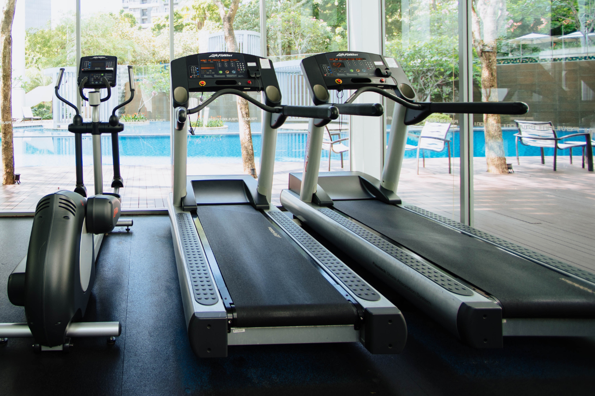

**🐰 TLDR: This article is about intermittent fasting, I do it and I Don't eat after 10pm or before 1pm. I exercise 30 mins a day (at least) and don't eat more than I ever did before during that eating window. I have lost 30 lbs of fat in one year and it's not coming back.**

For the past few years I have known about a way that I could regain my control over my weight. I'm not in my twenties anymore, my metabolism is not putting in the work to help me out as much anymore, I need to go extreme and push back.

I was working several days a week to train myself and because of this guy I think I had the balls to continue looking for a job after I already landed one. I remember him asking, how much are you worth, he told me, no I think you can make six figures doing development work. So I contacted another recruiter, and within days found a job in San Mateo California and I rejected the offer from a hospital in Florida in which I was suppose to start in a week. That opportunity turned into an engineering position with SolarCity and Tesla. If I was already a big Sonmez fan, I was an even bigger one now. Then, a few years later, I heard this podcast of his: [John, You're WRONG About Fasting!](https://www.youtube.com/watch?v=bRbXWo_EZJU). This gave me the information I needed to get started researching the topic on my own. I had some key buzz words to search on at least!

This mad me eager to start fasting and I wanted to understand more about glycogen stores for some reason. Fast forward a year and several Joe Rogan podcasts later talking about IF and some additional researching myself, I had been out at the pool with my son and he told me that I had man-boobs. That was it, I was going to show him.  I was already a little bit shy about taking my shirt off at the pool, in fact I was trying to get some sun before a trip we were planning during the summer. I was not only trying to get a tan, but had thought about a diet or exercise regimen so that by the time June/July came around I would feel better about my appearances.

We all want to look better. It's the reason we do these things and decide to workout or get into shape. Now to be honest I had never in my life tried to get into shape. I had went to the gym a few years back, but my regimen at the time did not match up with what I was eating and I had no concept of how many calories I should be eating each day and especially I had no idea that what time I ate was also important.

To make a longer story shorter, I started intermittent fasting and a simple workout regimen after researching and finding a lot of info on [Joe Rogan's podcast](https://www.youtube.com/user/PowerfulJRE/videos) and from a advertisement video (no shitting you) on YouTube called: [The Science based Six pack](https://www.youtube.com/watch?v=KzbRp0DvNVw).

With the information I learned from this podcast and this YouTube channel I penciled out my plan in a few hours. This plan I think could get anyone to get in shape if they do it.

I switched from a full-time engineer to [Developer Advocate for Telerik/Progress](https://www.telerik.com/blogs/author/eric-bishard). This change allowed me the freedom to train when I wanted to as I could work from home and one the weekends whatever. So I understand when people say that it's hard, but I say that if you follow this regimen it will be worth it. And I did do my first two months while I was in a full time engineering position driving to and from work. So it is possible.

I'm going to make some assumptions here and try to predict what I think *anyone can do if they subscribe to this regimen which consists of 2 things only that I commited to.

- You will eat on a time restriction (and not over eat)
- You will exercise a few days a week (heopefully during your fasting time)

If you do this I think that you can...

- Lose 20 lbs in 2 months and keep it off
- Look better and see results in one month
- Save money on food
- Start eating healthier
- Look better and feel better

*There are some people who have trouble with this regimen to to ailments like diabetes or other insulin issues. There are two types of diabetes, I am not an expert on diabetes, I know very little on the subject. If you have an ailment, consult your physician before trying this regimen. It works great fro one type of Diabetes from what I have heard and the other type of diabetes, well I'm not sure.*

Back to the business!

When my son told me I had man boobs, I realized he was trying to say something to me. "Dad I'm sure there is something you can do about your extra fat". But really, in a way, he was being honest and it made me think about what I could do to reverse this train. I was heading in the wrong direction. 

I'm a big fan of the Joe Rogan podcast, and I heard him speaking with [Dr Rhonda Patrick ](https://twitter.com/foundmyfitness). This [episode of the podcast](https://www.youtube.com/watch?v=9M8X_bs_fzI) highlighted her recent success with the regimen or at least that's what I got from it.

I also have listened many times to a book, I often listen when I am facing hunger or sugar cravings, to remind me what I'm suppose to be doing and why it's completely the natural way to do things.

So I have started doing a few things:

- Don't eat after 10pm
- Don't eat before 1pm 
- Exercise *three to six times a week
- Cutting back on caloric intake
- Eating healthy carbs as my first meal

*Exercise needs to be done, at first don't kill yourself try a few times a week. If you can burn 200 calories doing simple cardio, that's a great start. As you start gaining confidence in the regimen, do more, but don't go in reverse.

*As far as eating goes, I took a look at what I had been eating each day before I started my regimen and ensured and I made healthier choices or actually ate less. This can start with small changes that slowly get more healthier and eventually we start to cut one of the three meals a day completely out.

These things that I did above made it so that I could lose about 20 pounds in two months and I was learning as I went. I think you could do it faster and better, it just requires sticking to the regimen 6 days a week.

[How Many Calories Per Day Should I Eat?](https://www.healthline.com/nutrition/how-many-calories-per-day)

Above is the calculator I used to figure out how much I should eat. I found a [Sweet Kale Salad](https://www.taylorfarms.com/products/chopped-salad-kits/sweet-kale-chopped-kit/) and some [precooked chicken](https://www.tyson.com/products/grilled-chicken) at [Safeway](https://twitter.com/safeway) that I could prepare quickly everyday and salad dressing included fit within my guidelines, I also had to be careful at dinner not to over eat. But I could pretty much eat anything I like, just smaller portions. After doing this for a few weeks you will know if you eat more one day than the prior. It will be easy to step down (in calories) if needed also. The one thing I would highlight is that I stopped eating three meals each day, the second I got on this regimen. Except for Sundays. Sundays I eat a small breakfast, workout, eat a small lunch and a normal dinner. I abstain from fasting on this day always.

One year later I am no longer 182 lbs, I am closer to 150 (today I am 152). I have never been below 150 in probably 25 years. I think that as I start to put on muscle now, my weight is about to bottom out. I can write more about this in a  few months.

## Here Come Some Opinions of Mine

I think we all have unnatural hunger created by lies others have told us and we now tell ourselves. We are not meant to eat three times a day, I believe that we have become indoctrinated by large companies and even health professionals that we think eating the food pyramid and having a healthy breakfast lunch and dinner is the right thing to do. It's not. The faster we figure that out, the faster we can start to make some healthy decisions and get our bodies in check.

  

As a software developer, I think that the lifestyle actually lends itself to this diet if you think about it. We work in front of a computer for most of the day, we need some movement in our life. I suggest starting your day with only a few hours of work, taking a workout break, do some cardio or aerobics, treadmill whatever, then come back to work for the rest of the day. I can now get in a full days of work without eating, but I have been doing some form of intermittent fasting for almost one year. I don't expect this is possible right out of the gate unless you are a beast.

As I said before I'm a huge Joe Rogan fan and I wanted to leave everyone with this video:

[Why you should do Intermittent Fasting | Joe Rogan feat. GSP, Dr. Peter Attia, Dr. Rhonda Patrick](https://www.youtube.com/watch?v=JxjMdqevE88)

I hope this article inspires someone, if you have questions let me know, [DM me on Twitter](https://twitter.com/httpJunkie) I would love for this blog to turn into a good resource for others trying to find their way to fitness but struggling as a developer who works hard everyday or does not have the time. Teh great thing is that when fasting, you typically only eat two meals a day, so it's actually easier than what your doing right now?