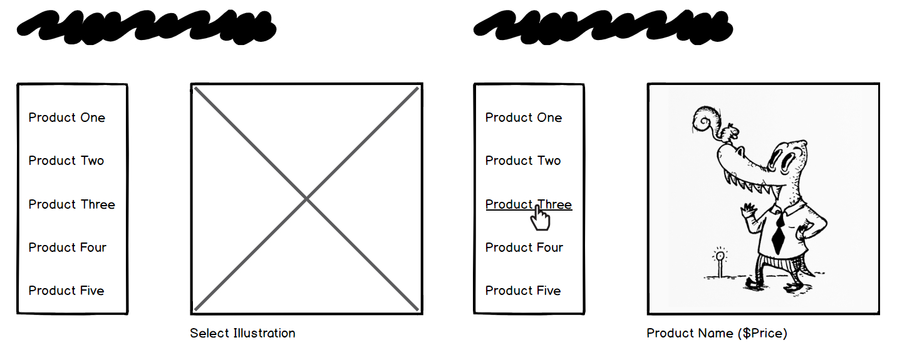

# Master Detail with React, Crystallize, Apollo and GraphQL 

With Crystallize, you can create structured content with products of any shape and easily query and render them in your app or framework of choice. This post shows how to take a catalogue of Illustrations that we have set up in our Crystallize Tenant and build a decoupled front-end using React to display each product in a master detail format. We will rely on using the **Apollo Client** and **GraphQL** to retrieve our data and provide a wrapper using a higher order component. Let's get started!

[Skip to the Meat I already have my GraphQL query!](#building-our-react-application)

## Testing Your Crystallize GraphQL Query

Creating a place to organize your ecommerce products is simple with [Crystallize]( https://crystallize.com), just create an account in one step with a Google or Facebook user and build a Tenant. For demo purposes today, I will use a Tenant that we have already setup named `demo`.

As the owner of a tenant on Crystallize, I can test my queries out in our [Crystallize GraphQL interface](https://api.crystallize.com/graphql) to visualize my data:

Notice the GraphQL query is a hierarchy of nested data that in a normal REST endpoint might take several round trips to retrieve. We just walk the Graph and we can cherry pick what we want! Try the following query in the Crystallize GraphiQL IDE:

```
{
	catalogue(url:"/illustrations", tenantID:"demo"){
		name
		id
		link
		content_fields
		children{
			link
			name
			product{
				id
				product_image
				price
				price_from
				link
				name
			}
		}
	}
}
```

When you execute the query in GraphiQL, the result is a `data`  object at the root, inside of `data` we have a `catalogue` object with a `name` and `link`, also there is an array named `children` with the `Illustrations` we would like to work with in our master detail page.

## Building Our React Application

We'll use Create React App to get us up and running fast. Ensure you have the [latest version of Node installed]( https://nodejs.org/en/download/ ), and use `npx` to create our React app.

`npx create-react-app illustration-demo`

Let's open this project in a code editor like Visual Studio Code!

`cd crystallize-api-demo && code .`

CRA uses Yarn so we will also use Yarn in our commands to build our application, let's do that!

`yarn start`

We should now see our application and the component you see being displayed can be located in the `src/App.js` file:


## Adding Dependencies

We need a client to query GraphQL inside of our application, the [Apollo GraphQL Client]( https://www.apollographql.com/docs/react/ ) will be our choice for this demo, let's add it to our project. make sure that you are in the root of our new Create React App and run:

```bash
yarn add apollo-boost @apollo/react-hooks graphql
```

For the purposes of the demo, we will also install `react-router-dom` to help us with basic linking and routing and a component to aid in basic flexbox layout called `simple-flexbox`:

```bash
yarn add react-router-dom simple-flexbox
```

With these installed we are ready to prepare our application, let's take a look at a wireframe mockup I made to help concept and visualize what I'm trying to build.



When we first visit our application, the url will be root `'/'` and our router will catch root and the `'/illustrations' ` path to a page that lists out our products as links on the left side of the page. To the right side will be a placeholder SVG in the spot where our illustration images should load, below it, we will have the text: **Select Illustration**. When a product link is clicked on we will see the image, name and price for that product appear in on the right.

All of this will be housed in a component named `IllustrationMasterDetail`. The menu on the left will be a child component named: `IllustrationList` and the details on the right a sibling component named `IllustrationDetails`. We will have a few other components named `NoImage` and `Error404` which are self explanatory but I felt helped to round out the application. 

We create a directory inside `src` named `components` and inside the following component files:

- Error404.jsx
- **IllustrationDetails.jsx**
- **IllustrationList.jsx**
- **IllustrationMasterDetail.jsx**
- NoImage.jsx
- **illustration.js**
- **withApolloProvide.js**
- 404.png

The ones I have bolded are the most important and teach the concepts we are tackling today, but adding all of these files is important, We are keeping all files in the `components` directory for the sake of simplicity. I have also removed the `logo.svg` and `App.scss` from the Create React App demo as they are not needed.

If you want to skip past the adding of files, you can cheat with this repo, set up ready to go at this exact point in the tutorial:

[httpJunkie / illustration-demo-start](https://github.com/httpJunkie/illustration-demo-start)  

If you start from that repo it will still be worth going over the next section to see what's included in each of the pages at this point. It helps to understand how we go about building something like this from scratch and what steps are involved.

## Adding The Code

We will start by updating the code in the `src/App.js` file, as we add code to each file we will briefly talk about what is happening. 

### public/index.html

```jsx
<link href="https://fonts.googleapis.com/css?family=Noto+Serif|Oxygen:300" rel="stylesheet">
```

I have just shown the line that we need to add instead of the entire file, this is just to give us access to some nicer fonts, as well we have a CSS page below that will have all of the CSS we need for the rest of the project. This is something you can explore on your own as we will not be focusing too much on style, but we still want our demo to look clean.

### src/index.css

```css
body {
  margin: 0;
  background-color: #f9f9f9;
  Font-Family: 'Noto Serif', Serif;
  Font-Size: 16px;
  -webkit-font-smoothing: antialiased;
  -moz-osx-font-smoothing: grayscale;
}

H1, H2, H3, H4, H5, H6 {
  Font-Family: 'Oxygen', Sans-Serif;
  margin-top: 0;
  color: #E77494;
}

a.menu {
  color: inherit;
  text-decoration: none;
  margin-bottom: 0.25em;
}
a.menu {
  background-image: linear-gradient(to left, #fff, #E77494 88%);
  background-position: 0% 100%;
  background-repeat: no-repeat;
  background-size: 00% 2px;
  background-position-y: 1.1em;
  transition: background-size cubic-bezier(0, 0.5, 0, 1) 1s;
}
a.menu:hover,
a.menu:visited:hover,
a.menu:active:hover {
  text-decoration: none;
  background-size: 100% 2px;
}
a.menu:focus,
a.menu:active {
  text-decoration: none;
  background-size: 100% 2px;
}

ul.illustration-list {
  padding: 0; margin: 0;
}
ul.illustration-list > li {
  list-style: none;
  line-height: 2.5em;
  font-size: 1em;
}

.pad-one {
  padding: 1em;
}

.illCrop {
  width: 440px;
  height: 440px;
  object-fit: none;
  object-position: center; 
  border: 1px #222 solid
}

.illPrice,
.illMessage {
  font-family:  'Oxygen', Sans-Serif;
  font-size: 2em;
}
```

### src/App.js

```jsx
import React from "react";
import { BrowserRouter, Route, Switch } from "react-router-dom";

import IllustrationMasterDetail from './components/IllustrationMasterDetail';
import Error404 from './components/Error404';

const App = () => {
 return (
  <div className="app-container pad-one">
    <BrowserRouter>
      <Switch>
       <Route exact path={["/illustrations/", "/"]} 
        render={(props) => 
          <IllustrationMasterDetail {...props} baseUrl={`/illustrations`} />
        }
       />
       <Route component={Error404} />
      </Switch>
     </BrowserRouter>
   </div>
 );
}

export default App;
```

In `App.js`, we import React Router's `BrowserRouter` and `Route` components for providing route data and declarative route definitions. We also use the `Switch` component to deliver either our Illustrations component which will be shown for the default route `'/'` or our `'Illustrations'` route or an `Error404` component that works as a catchall for undefined routes. 

You may have noticed our Route is using a `render` prop instead of a `component` prop and this is because we want to be able to pass some props to the `IllustrationMasterDetail` component when we use this method we need to be sure to spread the props we get from the route and pass them along. 

### src/components/IllustrationMasterDetail.jsx

```jsx
import React from 'react';
import { Link } from "react-router-dom";
import { Column, Row } from "simple-flexbox";

const IllustrationMasterDetail = ({ baseUrl, match }) => {
  const fullLink = `${baseUrl}/${match.params.illustration_link}`;

  return (
    <>
      <Link className='menu' to={`/illustrations`}>
        <h1>Snowball Digital Illustrations</h1>
      </Link>
      <Row horizontal="spaced">
        <Column flexGrow={1} style={{ minWidth: '165px', width: '35%' }}>
          <span>Left Side</span>
        </Column>
        <Column flexGrow={1} style={{ width: '75%' }}>
          <span>Right Side</span>
        </Column>
      </Row>
    </>
  )
};

export default IllustrationMasterDetail;
```

This page is the wrapper so to speak for our Illustration UI (list and detail components). It will load both side by side, the left being a menu with a list of products and the right being a component that shows a placeholder until a product is selected. For now, we will create the layout so that we have somewhere to put these two components. 

You will also notice that we are using `react-router-dom` for it's `Link` component and `simple-flexbox` to help with layout using their `Row` and `Column` components. You can learn more about both here: [ [React Router](https://reacttraining.com/react-router/web/guides/quick-start), [Simple Flexbox](https://www.npmjs.com/package/simple-flexbox) ]

One more thing to note is that we have `{ destructured }` our props and pulled out two of them by name. The `baseURL` was passed in manually and `match` is something we get from our route. We will need `match` in order to know when someone has selected a product and we will load the correct details based on the route, for instance, the route could be: `/Illustrations/Birdman`. This is one of our illustrations and when that URL is loaded we need to show the correct details on the right side of the page.

### src/components/Error404.jsx

```jsx
import React from "react";
import { Link } from "react-router-dom";
import http404 from './404.png';

function NoMatch ({ location }) {
  return (
    <div style={{padding: '1em', textAlign: 'center'}}>
      path: <code>{location.pathname}</code> not found, 
      <Link className='menu' to={`/`}> wanna get away?</Link>
      <br />
      
    </div>
  )
};

export default NoMatch;
```

This component that displays if no other routes are matched. We display the location they ended up and a link to get back home.

### src/components/NoImage.jsx

```jsx
import React from "react";

const NoImage = ({ stroke = "#555", fill = "#f9f9f9" }) => {
  return (
    <svg width="440px" height="440px" viewBox="0 0 441 441" 
      version="1.1" id="svg-no-image">
      <defs id="defs2" />
      <g id="layer1" transform="translate(0,143)">
        <path id="one" fill={fill} stroke={stroke} 
          d="M 440.78091,297.74834 220.39045,77.357885 0,297.74834 Z" />
        <path id="two" fill={fill} stroke={stroke} 
          d="M -1e-5,297.74835 220.39045,77.357885 -1e-5,-143.03257 Z" />
        <path id="three" fill={fill} stroke={stroke} 
          d="M -3.6e-5,-143.03259 220.39045,77.357885 440.7809,-143.03259 Z" />
        <path id="four" fill={fill} stroke={stroke} 
          d="M 440.78092,-143.0326 220.39045,77.357885 440.78092,297.74833 Z" />
      </g>
    </svg>
  )
}

export default NoImage
```

This file will be loaded initially, before the user has selected an `Illustration`. This component takes a `fill` and `stroke` prop for customization and returns an SVG. Each path of the SVG is a triangle positioned together to create a square, since they are outlined with a stroke is looks like a box with an **X** in it, I thought it would help to indicate that nothing has been selected. 

Alright, let's run our app:

`yarn start`


## Adding Our Crystallize Data for Illustrations

I tried to find a nice solution that is fairly plug and playable and not too hard to understand. My solution is to wrap our `IllustrationMasterDetail` component in an **Apollo Provider** using a higher-order-component. We will pass in our `IllustrationMasterdetail` component and a GraphQL URI to this HOC and it will wrap our component in our **Apollo Provider** giving us the ability to make queries from our `IllustrationMasterDetail` page or any of it's child components. 

Let's get the HOC created and add the following code:

### src/components/withApolloProvider.js

```jsx
import React from 'react';
import ApolloClient from 'apollo-boost';
import { ApolloProvider } from '@apollo/react-hooks';

const withApolloProvider = (WrappedComponent, graphqlEndpoint) => {
  const apolloClient = new ApolloClient({
    uri: graphqlEndpoint,
  });

  return (props) => (
    <ApolloProvider client={apolloClient}>
      <WrappedComponent {...props} />
    </ApolloProvider>
  );
};

export default withApolloProvider;

```

Our `IllustrationMasterDetail` component is being represented in this file by the `WrappedComponent`. All that is really happening here is we take a component as an argument and we return the same component wrapped in a Data Provider that exposes the Apollo Client that helps us to work with GraphQL.

Next we will update our `IllustrationMasterDetail` component:

### src/components/IllustrationMasterDetail.jsx

```jsx
import withApolloProvider from './withApolloProvider';

...

const WrappedComponent = 
    withApolloProvider(IllustrationMasterDetail,'https://api.crystallize.com/graphql');

export default WrappedComponent;
```

We have added an import for our HOC and replaced the original export of our `IllustrationMasterDetail` component instead returning the result of the HOC. It's that simple, and one of the simplest ways to be able to reuse this **Apollo Client** with another component, If we had a similar page that showed posters, maybe a `PosterMasterDetail`, we could reuse the wrapping logic of this HOC and not duplicate code.

If we step into react Dev Tools we can see that our `ApolloProvider` is now wrapped around our `IllustrationMasterDetail` component.


Our next step is to use `gql` from  `apollo-boost` and query our GraphQL, then we will be able to render our `IllustrationList` on the left side and pass some data to it. 

Before we move on, let's add the code we will need to display the product menu that will show up on the left side of the page.

### src/components/illustrationList.jsx

```jsx
import React from 'react';
import { Link } from "react-router-dom";

function IllustrationList({illustrations}) {
  const listItems = 
    illustrations.map(({ name, link, id }) => (
      <li key={`${name}-${id}`}>
        <Link className='menu' to={`${link}`}>{name}</Link>
      </li>
    )
  );
  return (
    <ul className={`illustration-list`}>
      {listItems}
    </ul>
  )
}

export default IllustrationList;
```

All we do here is grab our `illustrations` from the data passed into our prop of the same name and use that to render out a list of `Link` components from **React Router** that will allow us to change the URL path.

With that file in place we need to fetch the data to pass to it, this is a little more involved but should only take a few minutes to set up.

Add the following code to `illustration.js` we are simply placing the query in it's own file for organizational purposes:

### src/components/illustration.jsx

```js
import { gql } from 'apollo-boost';
export const illustrationGql = gql`
  {
    catalogue(url:"/illustrations", tenantID:"demo"){
      name
      id
      link
      content_fields
      children{
        link
        name
        product{
          id
          product_image
          price
          price_from
          link
          name
        }
      }
    }
  }
`;
```

I would normally put this into a directory named `gql` and have several other files or export from this file, but we are only working with one query, so we are just going to leave it right here for simplicity. The same query we ran in GraphiQL can be used here!

Let's import more code into `IllustrationMasterDetail`:

### src/components/IllustrationMasterDetail.jsx

```jsx
import { Column, Row } from "simple-flexbox";
import { useQuery } from '@apollo/react-hooks';

import { illustrationGql } from './illustration';
import withApolloProvider from './withApolloProvider';
import IllustrationList from './IllustrationList';

...

  const fullLink = `${baseUrl}/${match.params.illustration_link}`;
  const { loading, error, data } = useQuery(illustrationGql);
  
  if (loading) return <p>Loading...</p>;
  if (error) return <p>Error :(</p>;

  const illustrations = data.catalogue.children;

  return (
...

  <Row horizontal="spaced">
    <Column flexGrow={1} style={{minWidth:'165px',width:'35%'}}>
      <IllustrationList illustrations={illustrations} />
    </Column>
    <Column flexGrow={1} style={{ width: '75%' }}>
      <span>Right Side</span>
    </Column>
  </Row>
```

I have added three sections of code we need to update, as well I kept a few lines that don't need to be changed, this may aid you in knowing where to place each piece of code.

With that in place, let's update our Route in `App.js` :

### src/App.js

```jsx
<Switch>
  <Route exact path={["/illustrations/:illustration_link", "/illustrations/", "/"]}
    render={(props) => <IllustrationMasterDetail {...props} 
      baseUrl={`/illustrations`} />}
  />
  <Route component={Error404} />
</Switch>
```

We have only updated the `Illustrations` Route to match on the the product link and run our project.

`yarn start` 

Now our left menu (`IllustrationList`) should be on the page and working, if we click on any product, we should see the URL update!


This is some progress, let's add the code to the `IllustrationDetails` component:

### src/components/IllustrationDetails.jsx

```jsx
import React from "react";
import PropTypes from 'prop-types';
import NoImage from './NoImage';

function IllustrationDetails({illustration}) {
  return (illustration
    ? (<>
        <div>
          
          </img>
        </div>
        <div className="illPrice">
          {illustration.product.name} (${illustration.product.price})
        </div>
      </>)
    : (<>
        <div><NoImage fill={`#FEF1F4`} stroke={`#4C4F5A`}/></div>
        <div className="illMessage">Select an Illustration</div>
      </>)
  );
};

export default IllustrationDetails;

IllustrationDetails.propTypes = {
  illustrationData: PropTypes.object
};
```

What we do here is render a ternary that asks, "Is our `illustration` data `falsey` ?" if not, render the details (`product.product_image`, `product.name`, and `product.price`) otherwise, render this other block of code that contains our SVG placeholder graphic and text.

Also, you will notice that I used a `propType` to ensure that what is being passed into this component is of `PropTypes.object`. This is not absolutely needed for a demo, but it gives me some security that the component will be used in the right way or a decent error will be supplied.

Now let's add the final piece of code that will load this component into the right side of the page and pass some data that has filtered out all but the product we need using the JavaScript `find()` method.

### src/components/IllustrationMasterDetail.jsx

```jsx
import IllustrationList from './IllustrationList';
import IllustrationDetails from './IllustrationDetails';

...

  const illustrations = data.catalogue.children;
  const illustration = match.params.illustration_link
    ? illustrations.find(i => i.link === fullLink)
    : null;

  return (
...

  <Row horizontal="spaced">
    <Column flexGrow={1} style={{minWidth:'165px',width:'35%'}}>
      <IllustrationList illustrations={illustrations} />
    </Column>
    <Column flexGrow={1} style={{ width: '75%' }}>
      <IllustrationDetails illustration={illustration} />
    </Column>
  </Row>
```

I have added three sections of code we need to update, as well I kept a few lines that don't need to be changed, this may aid you in knowing where to place each piece of code.

With this last code update, we should be able to see everything in action now!


I hope you learned a little more about React, Crystallize API or both. 

The final code can be found here: [httpJunkie / illustration-demo-end](https://github.com/httpJunkie/illustration-demo-end)

We hope you liked this step by step tutorial on how to use Crystallize API and GraphQL data in your application, you should also check out the open source components that we have on our [developers page](https://crystallize.com/developers):

Crystallize OS React Components

- [React Image Srcset](https://crystallize.com/developers/react-components/react-image-srcset )
- [React Layout](https://crystallize.com/developers/react-components/react-layout)
- [Smooth payments with Node Klarna](https://crystallize.com/developers/react-components/node-klarna)
- [Crystallize Content Transformer](https://crystallize.com/developers/react-components/crystallize-content-transformer)
- [React Dialog](https://crystallize.com/developers/react-components/react-dialog)  

Resources for Learning GraphQL

- [GraphQL Full Course - Novice to Expert]( https://www.youtube.com/watch?v=ed8SzALpx1Q)
- [Apollo Basics]( https://www.apollographql.com/docs/tutorial/introduction)
- [The Apollo GraphQL platform]( https://www.apollographql.com/docs/intro/platform)  

Resources for Learning React

- [Intro to React]( https://reactjs.org/tutorial/tutorial.html)
- [React Docs: Getting Started]( https://reactjs.org/docs/getting-started.html)
- [Higher Order Components]( https://reactjs.org/docs/higher-order-components.html)
- [Introducing Hooks](https://reactjs.org/docs/hooks-intro.html)
- [React Community Support](https://reactjs.org/community/support.html)

